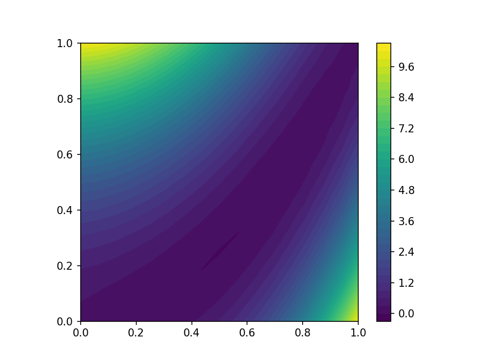
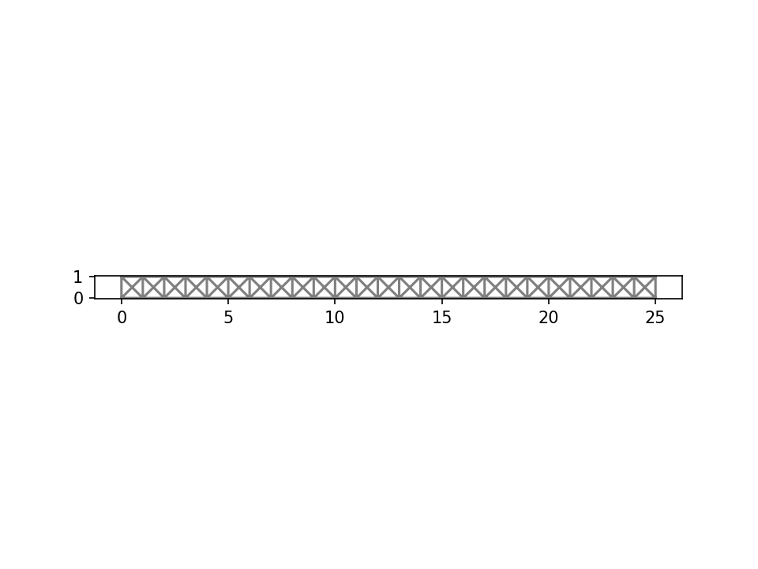

<!-- # Including partial differential equations in your PyMC3 model. -->

## PDE-based modeling
A partial differential equation (PDE) is an equation which imposes relations between the partial derivatives of a multivariable function. To solve a PDE means to find a function that satisfies prescribed relations, similarly to how we 
seek a certain number $x$ in algebraic equation $x^2 + 2x + 2 = 0$.

PDEs are foundational in modern scientific modeling of various phenomena in physics and engineering fields.
In this tutorial we a going to take a look at the elasticity phenomenon.
Solid objects will deform when some loads are applied to them; if the material is elastic, the object will return to its initial shape and size after removal of the load. So the elastic material behaves like a spring.

## Bayesian inference for PDE-based models
Excerpt from Albert Tarantola's book:
<blockquote>
Physical theories allow us to make predictions: given a complete description of a physical
system, we can predict the outcome of some measurements.
This problem of predicting
the result of measurements is called the modelization problem, the simulation problem,
the forward problem, or the primal problem.
The inverse problem consists of using the actual result of some
measurements to infer the values of the parameters that characterize the system.
While the forward problem has (in deterministic physics) a unique solution, the inverse
problem does not.
As an example, consider measurements of the gravity field around a
planet: given the distribution of mass inside the planet, we can uniquely predict the values
of the gravity field around the planet (forward problem),
but there are different distributions
of mass that give exactly the same gravity field in the space outside the planet.
Therefore,
the inverse problem — of inferring the mass distribution from observations of the gravity
field — has multiple solutions (in fact, an infinite number).
Because of this, in the inverse problem, one needs to make explicit any available a priori
information on the model parameters. One also needs to be careful in the representation of
the data uncertainties.
</blockquote>

PDEs can be parametrized to cover a range of different materials/fluids/environment conditions, etc.
A problem of recovering certain parameters from the physical observations is called an inverse problem.

The history of applying Bayesian statistics to inverse problems dates back to Albert Tarantola.
His book "Inverse Problem Theory: Methods for Data Fitting and Model Parameter Estimation" was published 1987.

Suggested reading:

 * "Inverse problems: A Bayesian perspective", Acta Numerica (2010), a review article by Andrew Stuart,
 * "The Bayesian Approach To Inverse Problems" by Masoumeh Dashti, Andrew Stuart https://arxiv.org/abs/1302.6989,
 * "An Introduction to Bayesian Scientific Computing" by Erkki Somersalo and Daniela Calvetti .

## Short intro to FEniCS: basic concepts and syntax
FEniCS is a library for an automated solution of partial differential equations using the finite element method (FEM).
Domain-specific languages (DSL) are tailored to specific application areas. PyMC3 implements a DSL for specifying and manipulating probability distributions for building probabilistic models.
FEniCS includes its own DSL for partial differential equations posed in a weak form called, the Unified Form Language (UFL).
UFL is used also in other finite element libraries, for example [Firedrake](https://www.firedrakeproject.org/) and [DUNE-FEM](https://www.dune-project.org/modules/dune-fem/).
UFL can be used for many different equations and in different application fields. It has been applied to a variety of complex, coupled nonlinear equations.

In many textbooks on finite element methods you will find the "Hello World!" task, the basic Poisson problem stated as follows:
Find $u\in V$ such that
$$a(u, v) = L(v) \quad \forall v \in V, \quad\quad(1)$$ 
where $a(u,v):= \int_\Omega \nabla u \cdot \nabla v \, dx$ is a bilinear form and $L(v):= \int_\Omega f v dx$ is a linear form for some source term $f$. Additionally we supplement the problem statement with the condition that the solution should be zero on boundaries of the domain.
This variational problem is straightforward to transform into FEniCS code.
```python
# wildcard import is not advisable in general
# however current fenics tutorials are written in this way
from fenics import *
mesh = UnitSquareMesh(10, 10)
V = FunctionSpace(mesh, "CG", 1)
u = TrialFunction(V)
v = TestFunction(V)
f = 1.0
a = inner(grad(u), grad(v)) * dx # left-hand-side of the equation (1)
L = f * v * dx # right-hand-side of the equation (1)
bc = DirichletBC(V, 0.0, "on_boundary")
sol = Function(V)
solve(a==L, sol, bc)
```
The FEniCS/UFL input closely matches the mathematical abstractions and syntax.

We can plot the solution to this problem
```python
import matplotlib.pyplot as plt
contours = plot(sol)
plt.colorbar(contours)
```


I recommend going through the [FEniCS Tutorial](https://fenicsproject.org/tutorial/) for a more detailed introduction to FEniCS.
It explains the fundamental concepts of the finite element method, FEniCS programming, and demonstrates how to quickly solve a range of PDEs.

### Meshes
The very first step in solving PDEs numerically is to discretize the domain.
In finite element methods the domain is subdivided into smaller elements: intervals, triangles, quadrilaterals, etc, together they form a mesh.
Let's choose, for simplicity, the domain to be the unit square $\Omega = [0, 1] \times [0, 1]$. Then we can create the mesh in FEniCS with
```python
import fenics
nx, ny = 16, 16
mesh = fenics.UnitSquareMesh(nx, ny)
```
We can plot the generated mesh
```python
fenics.plot(mesh)
```


### Functions
We can define scalar and vector fields on the mesh by interpolating the values of an algebraic expression to some space of functions. We need to make a function space $V$. It is constructed with a mesh, element family and the polynomial order.
The basic choice the element family that consists of continuous piecewise-linear functions in each triangle, which is abbreviated to CG1 for “continuous Galerkin” of order 1.
```python
V = fenics.FunctionSpace(mesh, "CG", 1)
```
Next, we have to make an expression for the function and interpolate it to the function space $V$.
The function `fenics.SpatialCoordinate` returns two symbolic objects `x`, `y` for the coordinates of each point of the mesh.
We can then use these symbols to define expressions for the function we’d like to analyze.
Finally, the function `fenics.project` takes in an expression and a function space, and returns a field from that function space. Let's represent the [Rosenbrock function](https://en.wikipedia.org/wiki/Rosenbrock_function) as a `fenics.Function`
```python
x, y = fenics.SpatialCoordinate(mesh)
a, b = 0.5, 10.0
expr = (a - x)**2 + b*(y - x**2)**2
rosenbrock_field = fenics.project(expr, V)

contours = fenics.plot(rosenbrock_field)
plt.colorbar(contours)
```


### Post-processing
The traditional workflow for analyzing results of FEniCS simulations is to save results to disk and open them in [ParaView](https://www.paraview.org/). FEniCS directly can be used for the basic tasks like evaluating a function at a point
```python
point = (0.5, 0.5)
print(f"Value at {point} is {rosenbrock_field(point)}")
```
```
Value at (0.5, 0.5) is 0.6211039565460185
```
or evaluating integrals.
To define an integral, we multiply an expression by `dx`, and then call the function `fenics.assemble` to evaluate it.
```python
from fenics import dx, assemble

print(f"Value of the integral is {assemble(x*y*dx)}")
print(f"Value of the integral is {assemble(rosenbrock_field*dx)}")
```
```
Value of the integral is 0.25
Value of the integral is 2.0833333333333357
```


## Intro to an example model from continuum mechanics
This section is based on ["Numerical tours of continuum mechanics using FEniCS."](https://comet-fenics.readthedocs.io/en/latest/index.html)

We consider here the case of a cantilever beam modeled as a 2D medium of dimensions $L \times H$.

<!--  -->

<figcaption>A cantilever beam. https://commons.wikimedia.org/w/index.php?curid=10046664</figcaption>
Geometrical parameters and mesh density are first defined and the rectangular domain is generated using the RectangleMesh function.

```python
import fenics

L = 25.0
H = 1.0
Nx = 25
Ny = 1
mesh = fenics.RectangleMesh(fenics.Point(0., 0.), fenics.Point(L, H), Nx, Ny, "crossed")
fenics.plot(mesh)

```


### Constitutive relation
We now define the material parameters which are here given in terms of a Young’s modulus $E$ and a Poisson coefficient $\nu$.
In the following, we will need to define the constitutive relation between the stress tensor $\sigma$ and the strain tensor $\varepsilon$.
The general expression of the linear elastic isotropic constitutive relation for a 3D medium is given by:
$$\boldsymbol{\sigma} = \lambda \text{tr}(\boldsymbol{\varepsilon})\mathbf{1} + 2\mu\boldsymbol{\varepsilon}$$
for a natural (no prestress) initial state where the Lamé coefficients are given by:
$$\lambda = \dfrac{E\nu}{(1+\nu)(1-2\nu)}, \quad \mu = \dfrac{E}{2(1+\nu)}$$
we will work only with a 2D displacement vector $u=(u_x, u_y)$ and will subsequently define the strain operator `eps` as follows:
```python
from fenics import sym, grad

def eps(v):
    return sym(grad(v))
```
which computes the 2x2 plane components of the symmetrized gradient tensor of any 2D vectorial field.

```python
from fenics import tr, Identity

E = fenics.Constant(1e5)
nu = fenics.Constant(0.3)

mu = E/2/(1+nu)
lmbda = E*nu/(1+nu)/(1-2*nu)

def sigma(v):
    return lmbda*tr(eps(v))*Identity(2) + 2.0*mu*eps(v)
```
### Weak formulation
For this example, we consider a continuous polynomial interpolation of degree 2 and a uniformly distributed loading
$\boldsymbol{f}=(0, -f)$ corresponding to the beam self-weight.
The continuum mechanics variational formulation (obtained from the virtual work principle) is given by:
$$\text{Find } \boldsymbol{u}\in V \text{ s.t. } \int_{\Omega} \boldsymbol{\sigma}(\boldsymbol{u}):\boldsymbol{\varepsilon}(\boldsymbol{v}) d\Omega = \int_{\Omega} \boldsymbol{f}\cdot\boldsymbol{v}  d\Omega \quad \forall\boldsymbol{v} \in V$$
which translates into the following FEniCS code:
```python
from fenics import inner, dx

rho_g = 1e-3
f = fenics.Constant((0, -rho_g))

V = fenics.VectorFunctionSpace(mesh, 'CG', degree=2)
du = fenics.TrialFunction(V)
u_ = fenics.TestFunction(V)
a = inner(sigma(du), eps(u_))*dx
l = inner(f, u_)*dx
```

### Solving
Fixed displacements are imposed on the left part of the beam, the solve function is then called and solution is plotted by deforming the mesh:
```python
def left(x, on_boundary):
    return fenics.near(x[0], 0.)

bc = fenics.DirichletBC(V, Constant((0.,0.)), left)

u = fenics.Function(V, name="Displacement")
fenics.solve(a == l, u, bc)

# the solution is amplified with 1e3 for the visuals
fenics.plot(1e3*u, mode="displacement")
```


The maximal deflection is compared against the analytical solution from [Euler-Bernoulli beam theory](https://en.wikipedia.org/wiki/Euler%E2%80%93Bernoulli_beam_theory) which is
$w_{beam} = \dfrac{qL^4}{8EI}$, $I$ is the [second moment of area](https://en.wikipedia.org/wiki/Second_moment_of_area) of the beam's cross-section.
```python
print("Maximal deflection:", -u(L, H/2.)[1])
print("Beam theory deflection:", float(rho_g*L**4/(2/3*E*H**3)))
```
```
Maximal deflection: 0.005317702470567223
Beam theory deflection: 0.005859375
```


## Implementing the continuum mechanics model in FEniCS
Let's implement the solver as a function.
```python
import fenics, fenics_adjoint
from fenics import tr, Identity, sym, grad, inner, dx
L = 25.0
H = 1.0
Nx = 25
Ny = 1
mesh = fenics_adjoint.RectangleMesh(fenics.Point(0., 0.), fenics.Point(L, H), Nx, Ny, "crossed")
V = fenics.VectorFunctionSpace(mesh, 'CG', degree=2)

def left(x, on_boundary):
    return fenics.near(x[0], 0.)

bc = fenics_adjoint.DirichletBC(V, fenics_adjoint.Constant((0., 0.)), left)

def solve_elasticity(E, ρ_g):
    f = fenics.as_vector([fenics_adjoint.Constant(0), -ρ_g])
    nu = fenics_adjoint.Constant(0.3)
    mu = 0.5 * E / (1 + nu)
    lmbda = E * nu / (1 + nu) / (1 - 2 * nu)
    def sigma(v):
        return lmbda * tr(eps(v)) * Identity(2) + 2.0 * mu * eps(v)
    def eps(v):
        return sym(grad(v))
    u = fenics.TrialFunction(V)
    v = fenics.TestFunction(V)
    a = inner(sigma(u), eps(v))*dx
    l = inner(f, v)*dx
    w = fenics_adjoint.Function(V)
    fenics_adjoint.solve(a == l, w, bc)
    return w

```

## Automatic differentiation & FEniCS, using [dolfin-adjoint](http://www.dolfin-adjoint.org/en/latest/)
In the previous section we've used `fenics_adjoint`. The aliases for this library is `dolfin_adjoint`, `pyadjoint`.
The dolfin-adjoint project helps with automatic generation of the discrete adjoint and tangent linear models from a primal model written in the Python interface to FEniCS and Firedrake.
Though it's not strictly necessary to use it, as UFL already has all the ingredients built-in.
For the example on how to enable automatic differentiation without `fenics_adjoint` for starters I suggest looking at the source code for [JAX-FEniCS project](https://github.com/IvanYashchuk/jax-fenics). (WARNING: familiarity both with UFL and JAX is strongly recommended).

Traditionally FEniCS tutorials started with `from fenics import *`, if then followed by `from fenics_adjoint import *` the user smoothly gets the adjoint annotated functions to be able to compute gradients. However, wildcard import should be avoided, therefore there is a burden on the new user to know exactly which functionality should be taken from `fenics_adjoint` package and what can be used from the main `fenics` package.

Let's say we want to evaluate the integral of the solution
>$$J(w) := \int_\Omega w \cdot w \, d\Omega$$
In order to calculate the derivative of $J$ with respect to the loading we use `pyadjoint.compute_gradient`
```python
import pyadjoint
E = fenics_adjoint.Constant(1e5)
ρ_g = fenics_adjoint.Constant(1e-3)

w = solve_elasticity(E, ρ_g)

J = fenics_adjoint.assemble(inner(w, w)*dx)
dJdρg = pyadjoint.compute_gradient(J, pyadjoint.Control(ρ_g))
print(f"dJ/dρg = {float(dJdρg)}")
```
```
dJ/dρg = 0.363338652567067
```

## Implementing a Theano Op that calls to FEniCS
Now when we have our `solve_elasticity` implemented it's time to make it usable from PyMC3/Theano! Finally a PyMC3 related thing.
```python
from fenics_pymc3 import create_fenics_theano_op
# Define FEniCS template representation of Theano/NumPy input
# that is we promise that our arguments are of the following types
# the choice is between Constant and Function
templates = (fenics_adjoint.Constant(0.0), fenics_adjoint.Constant(0.0))
theano_fem_solver = create_fenics_theano_op(templates)(solve_elasticity)
```
That's it! Now `theano_fem_solver` can be used within `pm.Model()`!

`create_fenics_theano_op` can also be used as a decorator, but then we lose the original FEniCS function
```python
@create_fenics_theano_op(templates)
def solve_elasticity(E, ρ_g):
    ...
    return solution
```

## Finally, building a PyMC3 model for inferring parameters of the continuum mechanics model

We have a solid foundation now for solving PDE-constrained Bayesian inference tasks.
In general it's a good strategy to keep the PDE model development separate from other tasks. Then FEniCS and PyMC3 worlds meet at calling `create_fenics_theano_op`.

```python
import pymc3 as pm
import theano.tensor as tt

loads = [[1.], [2.5], [5.]]
measurements = [0.11338, 0.28346, 0.56693]

with pm.Model() as model:

    E = pm.Normal("E", mu=1.1e5, sigma=0.3e5, shape=(1,))

    maximum_deflections = []
    for i in range(len(measurements)):
        ρ_g = loads[i]
        predicted_displacement = theano_fem_solver(E, ρ_g)
        maximum_deflection = tt.max(predicted_displacement)
        maximum_deflections.append(maximum_deflection)
    maximum_deflections = tt.stack(maximum_deflections)

    d = pm.Normal("d", mu=maximum_deflections, sd=1e-3, observed=measurements)

```
We can now call PyMC3 inference algorithms. First, let's look at the MAP estimate
```python
map_estimate = pm.find_MAP(model=model)
print(f"MAP estimate of E is {map_estimate['E']}")
```
```
100% [22/22 00:04<00:00 logp = 6.6135, ||grad|| = 1.1144e-05]
MAP estimate of E is [125000.40465515]
```
Of course NUTS also works
```python
with model:
    trace = pm.sample(100, chains=1, cores=1, tune=100)

pm.summary(trace)
```
```
Only 100 samples in chain.
Auto-assigning NUTS sampler...
Initializing NUTS using jitter+adapt_diag...
Sequential sampling (1 chains in 1 job)
NUTS: [E]
Sampling 1 chain for 100 tune and 100 draw iterations (100 + 100 draws total) took 310 seconds.
Only one chain was sampled, this makes it impossible to run some convergence checks
```
```
            mean       sd      hdi_3%    hdi_97%  mcse_mean  mcse_sd  ess_mean  ess_sd  ess_bulk  ess_tail  r_hat
E[0]  132148.824  285.805  131637.637  132484.79    245.799  237.897       1.0     1.0       1.0      13.0    NaN
```

Now we've done all that only to remember that we have the Euler-Bernoulli beam theory, which tells us
that given the maximum deflection, the loading, and beam geometry we can calculate the Young's modulus. However, for many other PDEs we don't have closed form relationships between measurements and parameters.
```python
print(f"Analytical estimate of E is
        {loads[0][0] * L**4 / (2/3 * H**3 * measurements[0])}")
```
```
Analytical estimate of E is 137738.01128349788
```

## Conclusion
PyMC3 and FEniCS are both very popular libraries in their domains.
And now we have a tool that bridges them and allows us to experiment with
the parameters estimation for PDEs.
However, as MCMC requires thousands of calls to the solver, the solver function needs to be optimized to make the call
as fast as possible. Here we didn't focus on the performance at all.
There are many ways of making the solver faster. If you think that your solver is "slow", make benchmarks and ask for improvement advice at [FEniCS Discourse forum](https://fenicsproject.discourse.group/).

Feedback and questions are welcome either via [GitHub issue](https://github.com/IvanYashchuk/fenics-pymc3/issues/new) if you face a bug
or [PyMC3 discourse](https://discourse.pymc.io/) (ping @ivan) for general discussion.

<sub><sup>Content provided under a Creative Commons Attribution license, CC-BY 4.0</sup></sub>
